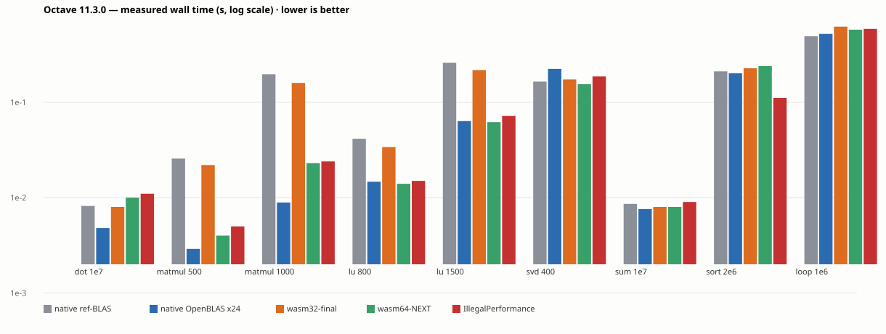
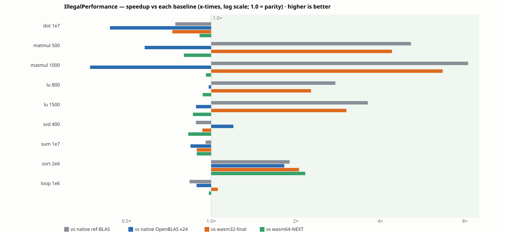

# Octave-Full-Wasm

[English](README.md) · [中文](README.zh.md) · [Deutsch](README.de.md)

GNU Octave 11.3.0 编译为 WebAssembly —— 一个完整的数值计算环境（解释器、BLAS/LAPACK、
绘图、约 500 个包）**完全跑在你的浏览器里**：纯客户端计算，**没有任何服务端执行**。

**现役产线：`w64` 车道（WebAssembly memory64 + 线程 + relaxed-FMA OpenBLAS + mimalloc
+ Rust `sort` 内核）**，与其他车道共用同一套网页 UI。所有数值结果均为 IEEE 754
binary64 —— 并经下文显式审计。

---

## 性能（2026-10-07 实测：原生 5 轮 / wasm 3 轮交错中位）



| 负载（秒） | 原生 ref-BLAS | 原生 OpenBLAS ×24 | wasm32-final | wasm64-NEXT | **IllegalPerformance** |
|---|---|---|---|---|---|
| dot 1e7 | 0.0082 | **0.0048** | 0.0080 | 0.0100 | 0.0110 |
| matmul 500 | 0.0257 | **0.0029** | 0.0220 | 0.0040 | 0.0050 |
| matmul 1000 | 0.1971 | **0.0089** | 0.1600 | 0.0230 | 0.0240 |
| lu 800 | 0.0415 | **0.0147** | 0.0340 | 0.0140 | 0.0150 |
| lu 1500 | 0.2598 | **0.0636** | 0.2180 | 0.0620 | 0.0720 |
| svd 400 | 0.1650 | 0.2243 | 0.1740 | **0.1550** | 0.1870 |
| sum 1e7 | 0.0086 | **0.0076** | 0.0080 | 0.0080 | 0.0090 |
| **sort 2e6** | 0.2111 | 0.2020 | 0.2280 | 0.2400 | **0.1110** |
| loop 1e6 | **0.4934** | 0.5226 | 0.6220 | 0.5780 | 0.5890 |



**IllegalPerformance 的实际比值**（基线时间 ÷ IP 时间；9 项几何平均）：

- **对原生 Octave（默认 ref-BLAS）= 1.96×**（纯 BLAS 轴 **3.16×**）
- **对 wasm32-final（冻结的 wasm32 线）= 1.86×**（matmul 1000 单项 **6.7×**）
- **对 wasm64-NEXT = 0.99×**——全面平价，唯一实质优势 = **sort 2.16×**
- **对原生 OpenBLAS ×24 = 0.80×**——原生多线程天花板在纯 BLAS 上仍领先 1.25×，
  但 **sort（1.82×）与 svd（1.20×）IP 反超**

## IEEE 754 投产评估

24 字段电池（`test/fixtures/ieee754/battery.m`）跑 **6 个配置**（4 条 wasm 车道 +
原生 ref-BLAS + 原生 OpenBLAS ×24）：

- **23/24 字段处处逐位一致**：round-half-to-even 舍入、±0 位模式、规范 NaN、
  Inf/除法、次正规数、eps 边界、定种子 `rand`（MT19937 原生↔wasm 逐位同）、
  `sin`/`pow`/除法（musl vs glibc 抽样逐位同）。
- 唯一差异 = **dgemm 求和顺序 vs 分步未折叠参考**（最大 6.6 ulp）——**原生 OpenBLAS
  也有**（10000 元素中 3522 个，4.99e-16）。每个加/乘都正确舍入，只是顺序不同
  ⇒ IEEE 合规。
- `relaxed_madd`（81 处，OpenBLAS rsimd 内核）：WebAssembly 允许 fused *或* unfused
  求值——**两种都是 IEEE 754 合规结果**。披露：w64 的 BLAS 结果**跨浏览器引擎**
  可能在末位有差异（与原生 OpenBLAS 跨 CPU 微架构同类）；逐元素数学不受影响
  （0 发散）。

**判决：wasm32-final 与 IllegalPerformance 线均准予投产。**
复跑：`test/fixtures/ieee754/battery.m`，日志在 `w64-logs/ieee-*.log`。

## IllegalPerformance 线发了什么

- **rust-sort** —— `sort` 的 Rust（driftsort）内核，以**源缝**接入：弱符号 +
  链接期旋钮（`RUST_SORT`）；摘除 = 重链不带库，树对象零改动。差分门：22 域逐位
  一致 + 4/4 变异被抓；**sort 2e6 = 对 wasm64-NEXT 2.16×、对原生 OpenBLAS 1.82×**。
- **G6 延迟仪器** —— 块级内核的批量 quit 检查延迟上界（候选④ xpow 驱动层实测
  ≤2.1% 被**排除**）。
- 封口审计：libm（IEEE 锁死）、fill/fft（带宽绑定）、xpow 驱动层（≤2.1%）——
  **无已知剩余上升空间**（复跑件在 `w64-logs/`）。

## 架构

同一解释器的四条部署**车道**，按浏览器能力自动选档（`lanes.js`）：
`base`（wasm32 单线程）→ `threads`（wasm32 + pthread）→
`w64`（memory64 + 线程 + FMA + mimalloc + rust-sort）/ `w64-base`。
不带 COI 头服务会**静默**落到 `base` 档——见[部署工单](https://github.com/ArchivalEra/Octave-Full-Wasm/issues/2)。

可替换部件（BLAS、分配器、Rust 内核）是**带契约的插件**：模式表旋钮 → declared 标签
→ 产物探针 → 双向闸门（`plugin-check.py`）→ 事实台账条目。Octave 上游更新走
**fork/submodule 管线**：`upstream/octave`（分支 `wasm/11.3.0`）是我们的 fork——
合并上游 → 重编 → 跑车道 SOP（`build/113/NOTES-upstream.md`）；pin/见证闸门
（`witness-upstream-pin.py`）每次提交断言容器树 == fork pin。

## 运行

```sh
python3 build/serve-coi.py --dir /mnt/hdd/octave-wasm-build/site --port 8761
# 打开 http://127.0.0.1:8761/   （COI 头是硬要求 —— 见 issue #2）
```

本仓**不含 CI 自动部署**——部署为手工操作，按 [DEPLOY.md](DEPLOY.md)。
部署硬要求 + 验收程序：[DEPLOY.md](DEPLOY.md) 与
[issue #2](https://github.com/ArchivalEra/Octave-Full-Wasm/issues/2)。UI 接入：
[Embed API](docs/embed-api.md) 与 [issue #1](https://github.com/ArchivalEra/Octave-Full-Wasm/issues/1)。

## 分支（三条独立可持续维护的线）

| 分支 | fork pin（`upstream/octave`） | 定位 |
|---|---|---|
| `wasm32-final` | —（冻结） | wasm32 归档线 |
| `wasm64-NEXT` | `a5a7208`（平台补丁+f77 修复，**无 rust 缝**） | 中庸 wasm64 线——已验证：从 fork pin 全新重编 = 与现役产物逐字节同 |
| `IllegalPerformance` | `f4bf15b`（+ rust-sort 源缝） | 激进 wasm64 线——**2026-10-07 已发运**（8761 w64 = `f6fec91f`，IEEE 已评估，对本线基线 sort 2.16×） |

三条线经**同一条 fork 管线**吃上游 Octave 更新（`upstream/octave` 分支
`wasm/11.3.0`）；各线 pin 各自的 fork 提交。共享构建容器里换线 = submodule update +
重供给 + 部署该线的 `relink.sh`/`link-web.sh` + `OCTAVE_WASM_BASE` 指该线站点 +
`core.hooksPath` 指该线的钩子（IP 线 = `reflect-hooks/`，另两线 = `.githooks/`）
（见 `maintaince.md`）。

## 仓库地图

- `STATE.md` —— 活状态；`build/FACTS.json` —— 实测数字台账（每键带复跑命令）
- `zreflect/` —— 事实系统（**2026-10-09 采纳 Einfacht 重构版**：闸门平台 / 发现式名录 / 旋钮登记 / world 闸门）；`zreflect/measure_octave.py` 是本仓数据层，`reflect-hooks/Einfacht.env` 是旋钮载体
- `HISTORY.md` —— 逐批 append-only 记录（上文全部证据在 §5.77–§5.103）
- `maintaince.md` —— 方向地图；`docs/embed-api.md` —— 嵌入契约；`DEPLOY.md` —— 部署
- `build/113/` —— 车道构建配方 + 闸门；`test/browser/` —— 验收 harness（`SWEEP_JOBS=4` 可并行）
- 图形（2026-10-09 起**引擎权威**）：`bridge/octave-core.js` 保护核心 `m/plot` 树不受宿主影子桩污染（快照 + 还原 + 删新建），`p5canvas.js`/`queue.js` 经 `window.__octaveHosts` 解析模块 ⇒ embed 形态下图能上屏；验收 = `accept-gfx-isolation` + `accept-gfx-render`
- `.scratch/open-questions/issues/` —— 本地工单 tracker
- `docs/agents/upstream-issues.md` — 反哺上游 [Einfacht](https://github.com/ArchivalEra/Einfacht) 的 issue 留档

仓库跟踪文件清单（路径 + 字节数）由钩子维护在 [README.md 的 AUTO:FILES 区块](README.md)。

## 钩子

本仓用白名单 `.gitignore`（默认拒绝，逐项放行）+ git hooks：

- `pre-commit`：重算 README 的 AUTO 区块、校验白名单，跑事实/一致性/插件/仪器闸门
  与**三语 README 同步闸门**（`check_readme_sync.py`，移植自
  [Einfacht](https://github.com/ArchivalEra/Einfacht)）：三份语言 README 必须存在、
  非空、互链。
- `pre-push`：README 新鲜度 + 三语闸门的**推送集模式**——任何触碰一份语言 README 的
  推送必须三份同批更新。
- 安装：`bash .githooks/install.sh`（设 `core.hooksPath`）。

## 许可

**AGPL-3.0-or-later**（全文见 [`LICENSE`](LICENSE)）。对外分发的 wasm 二进制静态链接
GPLv3 的 Octave、GPLv2+ 的 FFTW、LGPL 的 libsndfile 及若干 BSD/permissive 组件——
这种混合**没有 AGPL-3.0 以外的选择**。

本程序是自由软件：你可以按自由软件基金会发布的 GNU Affero 通用公共许可证
（第 3 版，或你选择的任何更新版本）的条款再分发和/或修改它。本程序分发时希望它有用，
但**不提供任何担保**；也不提供适销性或特定用途适用性的默示担保。

按 AGPL-3.0 第 13 条（网络交互条款），通过计算机网络使用本程序的用户有权获得对应
源码：**本仓即该源码**；构建可在 `o113` 容器内完整复现（配方见 `build/CLIBS.md`）。
逐组件许可与版权：[`THIRD-PARTY-NOTICES.md`](THIRD-PARTY-NOTICES.md)。
